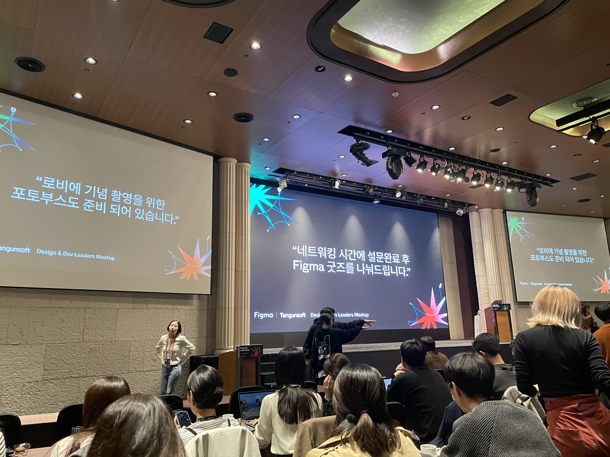

{:height="150px" width="150px"}

---
-

# **그래픽 저작도구 Figma Vs. 생산성 협업 플랫폼**

  

# **마치며**
디자인 시스템은 일관성있는 자원과 관리를 넘어 제품 전반에 걸친 생산성으로 확대해 나가고 있다.
Dev Mode는 디자인 시스템에서 가장 이상적으로 생각하는 디자인과 개발을 하나의 언어로 풀어 쓰는 것이다.
제품의 관점에서 구현 상태를 알 수 있는 청사진과 같다.

    